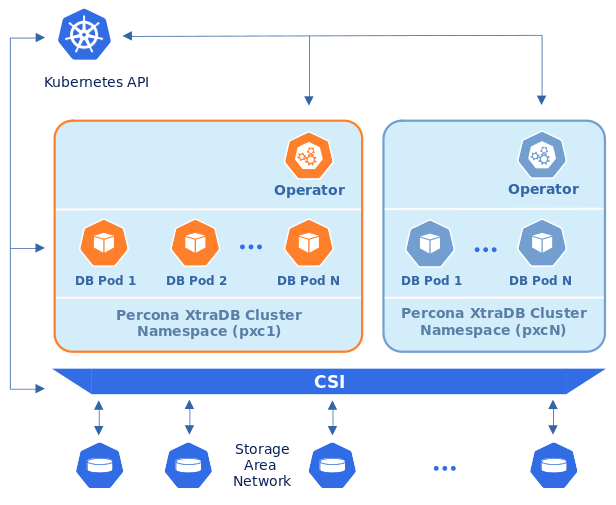

# Install Percona XtraDB Cluster in multi-namespace (cluster-wide) mode

By default, Percona Operator for MySQL based on Percona XtraDB Cluster functions in a specific Kubernetes
namespace. You can create one during installation (like it is shown in the
[installation instructions](kubernetes.md#install-kubernetes)) or just use the `default`
namespace. This approach allows several Operators to co-exist in one
Kubernetes-based environment, being separated in different namespaces:



Still, sometimes it is more convenient to have one Operator watching for
Percona XtraDB Cluster custom resources in several namespaces.

We recommend running Percona Operator for MySQL in a traditional way,
limited to a specific namespace. But it is possible to run it in so-called
*cluster-wide* mode, one Operator watching several namespaces, if needed:


!!! note

    Please take into account that if several Operators are configured to
    watch the same namespace, it is entirely unpredictable which one will get
    ownership of the Custom Resource in it, so this situation should be avoided.

To use the Operator in such *cluster-wide* mode, you should install it with a
different set of configuration YAML files, which are available in the `deploy`
folder and have filenames with a special `cw-` prefix: e.g.
`deploy/cw-bundle.yaml`.

While using this cluster-wide versions of configuration files, you should set
the following information there:

* `subjects.namespace` option should contain the namespace which will host
    the Operator,

* `WATCH_NAMESPACE` key-value pair in the `env` section should have
    `value` equal to a  comma-separated list of the namespaces to be watched by
    the Operator, *and* the namespace in which the Operator resides (or just a
    blank string to make the Operator deal with *all namespaces* in a Kubernetes
    cluster).

    !!! note

        The list of namespaces to watch is fully supported by Percona
        Distribution for MySQL Operator starting from the version 1.7. In version
        1.6 you can only use cluster-wide mode with empty `WATCH_NAMESPACE` key
        to watch all namespaces.

    The following simple example shows how to install Operator cluster-wide on
    Kubernetes.


1. First of all, clone the percona-xtradb-cluster-operator repository:

    ```bash
    $ git clone -b v{{ release }} https://github.com/percona/percona-xtradb-cluster-operator
    $ cd percona-xtradb-cluster-operator
    ```

2. Let’s suppose that Operator’s namespace should be the `pxc-operator` one.
    Create it as follows:

    ```bash
    $ kubectl create namespace pxc-operator
    ```

    Namespaces to be watched by the Operator should be created in the same way
    if not exist. Let’s say the Operator should watch the `pxc` namespace:

    ```bash
    $ kubectl create namespace pxc
    ```

3. Apply the `deploy/cw-bundle.yaml` file with the following command:

    ```bash
    $ kubectl apply -f deploy/cw-bundle.yaml -n pxc-operator
    ```

4. After the Operator is started, Percona XtraDB Cluster can be created at any
    time by applying the `deploy/cr.yaml` configuration file, like in the case
    of normal installation:

    ```bash
    $ kubectl apply -f deploy/cr.yaml -n pxc
    ```

    The creation process will take some time. The process is over when both
    operator and replica set Pods have reached their Running status:

    ```text
    NAME                                               READY   STATUS    RESTARTS   AGE
    cluster1-haproxy-0                                 2/2     Running   0          6m17s
    cluster1-haproxy-1                                 2/2     Running   0          4m59s
    cluster1-haproxy-2                                 2/2     Running   0          4m36s
    cluster1-pxc-0                                     3/3     Running   0          6m17s
    cluster1-pxc-1                                     3/3     Running   0          5m3s
    cluster1-pxc-2                                     3/3     Running   0          3m56s
    percona-xtradb-cluster-operator-79966668bd-rswbk   1/1     Running   0          9m54s
    ```

5. Check connectivity to newly created cluster

    ```bash
    $ kubectl run -i --rm --tty percona-client --image=percona:5.7 --restart=Never --env="POD_NAMESPACE=pxc" -- bash -il
    percona-client:/$ mysql -h cluster1-proxysql -uroot -proot_password
    ```
