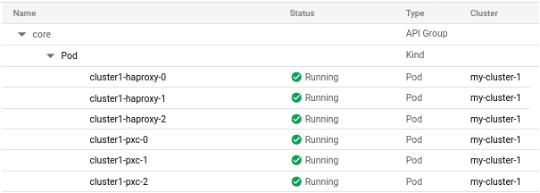
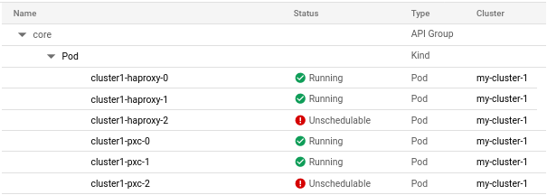

# Install Percona XtraDB Cluster on Google Kubernetes Engine (GKE)

This quickstart shows you how to configure the Percona Operator for MySQL based on Percona XtraDB Cluster with the Google Kubernetes Engine. The document assumes some experience with Google Kubernetes Engine (GKE). For more information on the GKE, see the [Kubernetes Engine Quickstart](https://cloud.google.com/kubernetes-engine/docs/quickstart).

## Prerequisites

All commands from this quickstart can be run either in the **Google Cloud shell** or in **your local shell**.

To use *Google Cloud shell*, you need nothing but a modern web browser.

If you would like to use *your local shell*, install the following:

1. [gcloud](https://cloud.google.com/sdk/docs/quickstarts). This tool is part of the Google Cloud SDK. To install it, select your operating system on the [official Google Cloud SDK documentation page](https://cloud.google.com/sdk/docs) and then follow the instructions.

2. [kubectl](https://cloud.google.com/kubernetes-engine/docs/quickstart#choosing_a_shell). It is the Kubernetes command-line tool you will use to manage and deploy applications. To install the tool, run the following command:

    ```bash
    $ gcloud auth login
    $ gcloud components install kubectl
    ```

## Configuring default settings for the cluster

You can configure the settings using the `gcloud` tool. You can run it either in the [Cloud Shell](https://cloud.google.com/shell/docs/quickstart) or in your local shell (if you have installed Google Cloud SDK locally on the previous step). The following command will create a cluster named `my-cluster-1`:

```bash
$ gcloud container clusters create my-cluster-1 --project <project name> --zone us-central1-a --cluster-version {{ gkerecommended }} --machine-type n1-standard-4 --num-nodes=3
```

!!! note

    You must edit the following command and other command-line statements to replace the `<project name>` placeholder with your project name. You may also be required to edit the *zone location*, which is set to `us-central1` in the above example. Other parameters specify that we are creating a cluster with 3 nodes and with machine type of 4 vCPUs and 45 GB memory.

You may wait a few minutes for the cluster to be generated, and then you will see it listed in the Google Cloud console (select *Kubernetes Engine* → *Clusters* in the left menu panel):


Now you should configure the command-line access to your newly created cluster to make `kubectl` be able to use it.

In the Google Cloud Console, select your cluster and then click the *Connect* shown on the above image. You will see the connect statement configures command-line access. After you have edited the statement, you may run the command in your local shell:

```bash
$ gcloud container clusters get-credentials my-cluster-1 --zone us-central1-a --project <project name>
```

## Installing the Operator

1. First of all, use your [Cloud Identity and Access Management (Cloud IAM)](https://cloud.google.com/iam) to control access to the cluster. The following command will give you the ability to create Roles and RoleBindings:

    ```bash
    $ kubectl create clusterrolebinding cluster-admin-binding --clusterrole cluster-admin --user $(gcloud config get-value core/account)
    ```

    The return statement confirms the creation:

    ```text
    clusterrolebinding.rbac.authorization.k8s.io/cluster-admin-binding created
    ```

2. Create a namespace and set the context for the namespace. The resource names must be unique within the namespace and provide a way to divide cluster resources between users spread across multiple projects.

    So, create the namespace and save it in the namespace context for subsequent commands as follows (replace the `<namespace name>` placeholder with some descriptive name):

    ```bash
    $ kubectl create namespace <namespace name>
    $ kubectl config set-context $(kubectl config current-context) --namespace=<namespace name>
    ```

    At success, you will see the message that namespace/<namespace name> was created, and the context (gke_<project name>_<zone location>_<cluster name>) was modified.

3. Use the following `git clone` command to download the correct branch of the percona-xtradb-cluster-operator repository:

    ```bash
    $ git clone -b v{{ release }} https://github.com/percona/percona-xtradb-cluster-operator
    ```

    After the repository is downloaded, change the directory to run the rest of the commands in this document:

    ```bash
    $ cd percona-xtradb-cluster-operator
    ```

4. Deploy the Operator with the following command:

    ```bash
    $ kubectl apply -f deploy/bundle.yaml
    ```

    The following confirmation is returned:

    ```text
    customresourcedefinition.apiextensions.k8s.io/perconaxtradbclusters.pxc.percona.com created
    customresourcedefinition.apiextensions.k8s.io/perconaxtradbclusterbackups.pxc.percona.com created
    customresourcedefinition.apiextensions.k8s.io/perconaxtradbclusterrestores.pxc.percona.com created
    customresourcedefinition.apiextensions.k8s.io/perconaxtradbbackups.pxc.percona.com created
    role.rbac.authorization.k8s.io/percona-xtradb-cluster-operator created
    serviceaccount/percona-xtradb-cluster-operator created
    rolebinding.rbac.authorization.k8s.io/service-account-percona-xtradb-cluster-operator created
    deployment.apps/percona-xtradb-cluster-operator created
    ```

5. The operator has been started, and you can create the Percona XtraDB cluster:

    ```bash
    $ kubectl apply -f deploy/cr.yaml
    ```

    The process could take some time.
    The return statement confirms the creation:

    ```text
    perconaxtradbcluster.pxc.percona.com/cluster1 created
    ```

6. During previous steps, the Operator has generated several [secrets](https://kubernetes.io/docs/concepts/configuration/secret/), including the password for the `root` user, which you will need to access the cluster.

    Use `kubectl get secrets` command to see the list of Secrets objects (by default Secrets object you are interested in has `my-cluster-secrets` name). Then `kubectl get secret my-cluster-secrets -o yaml` will return the YAML file with generated secrets, including the root password which should look as follows:

    ```yaml
    ...
    data:
      ...
      root: cm9vdF9wYXNzd29yZA==
    ```

    Here the actual password is base64-encoded, and `echo 'cm9vdF9wYXNzd29yZA==' | base64 --decode` will bring it back to a human-readable form.

## Verifying the cluster operator

It may take ten minutes to get the cluster started. You  can verify its creation with the `kubectl get pods` command:

```text
NAME                                               READY   STATUS    RESTARTS   AGE
cluster1-haproxy-0                                 2/2     Running   0          6m17s
cluster1-haproxy-1                                 2/2     Running   0          4m59s
cluster1-haproxy-2                                 2/2     Running   0          4m36s
cluster1-pxc-0                                     3/3     Running   0          6m17s
cluster1-pxc-1                                     3/3     Running   0          5m3s
cluster1-pxc-2                                     3/3     Running   0          3m56s
percona-xtradb-cluster-operator-79966668bd-rswbk   1/1     Running   0          9m54s
```

Also, you can see the same information when browsing Pods of your cluster in Google Cloud console via the *Object Browser*:



If all nodes are up and running, you can try to connect to the cluster with the following command:

```bash
$ kubectl run -i --rm --tty percona-client --image=percona:8.0 --restart=Never -- bash -il
```

Executing this command will open a `bash` command prompt:

```text
If you don't see a command prompt, try pressing enter.
$
```

Now run `mysql` tool in the percona-client command shell using the password obtained from the secret:

```bash
mysql -h cluster1-haproxy -uroot -proot_password
```

This command will connect you to the MySQL monitor.

```text
mysql: [Warning] Using a password on the command line interface can be insecure.
Welcome to the MySQL monitor.  Commands end with ; or \g.
Your MySQL connection id is 1976
Server version: 8.0.19-10 Percona XtraDB Cluster (GPL), Release rel10, Revision 727f180, WSREP version 26.4.3

Copyright (c) 2009-2020 Percona LLC and/or its affiliates
Copyright (c) 2000, 2020, Oracle and/or its affiliates. All rights reserved.

Oracle is a registered trademark of Oracle Corporation and/or its
affiliates. Other names may be trademarks of their respective
owners.

Type 'help;' or '\h' for help. Type '\c' to clear the current input statement.
```

The following example will use the MySQL prompt to check the `max_connections` variable:

```bash
mysql> SHOW VARIABLES LIKE "max_connections";
```

The return statement displays the current max_connections.

```text
+-----------------+-------+
| Variable_name   | Value |
+-----------------+-------+
| max_connections | 79    |
+-----------------+-------+
1 row in set (0.02 sec)
```

## Troubleshooting

If `kubectl get pods` command had shown some errors, you can examine the problematic Pod with the `kubectl describe <pod name>` command.  For example, this command returns information for the selected Pod:

```bash
$ kubectl describe pod cluster1-haproxy-2
```

Review the detailed information for `Warning` statements and then correct the configuration. An example of a warning is as follows:

*Warning  FailedScheduling  68s (x4 over 2m22s)  default-scheduler  0/1 nodes are available: 1 node(s) didn’t match pod affinity/anti-affinity, 1 node(s) didn’t satisfy existing pods anti-affinity rules.*

Alternatively, you can examine your Pods via the *object browser*. Errors will look as follows:



Clicking the problematic Pod will bring you to the details page with the same warning:


## Removing the GKE cluster

There are several ways that you can delete the cluster.

You can clean up the cluster with the `gcloud` command as follows:

```bash
$ gcloud container clusters delete <cluster name>
```

The return statement requests your confirmation of the deletion. Type `y` to confirm.

Also, you can delete your cluster via the GKE console. Just click the appropriate trashcan icon in the clusters list:


The cluster deletion may take time.
